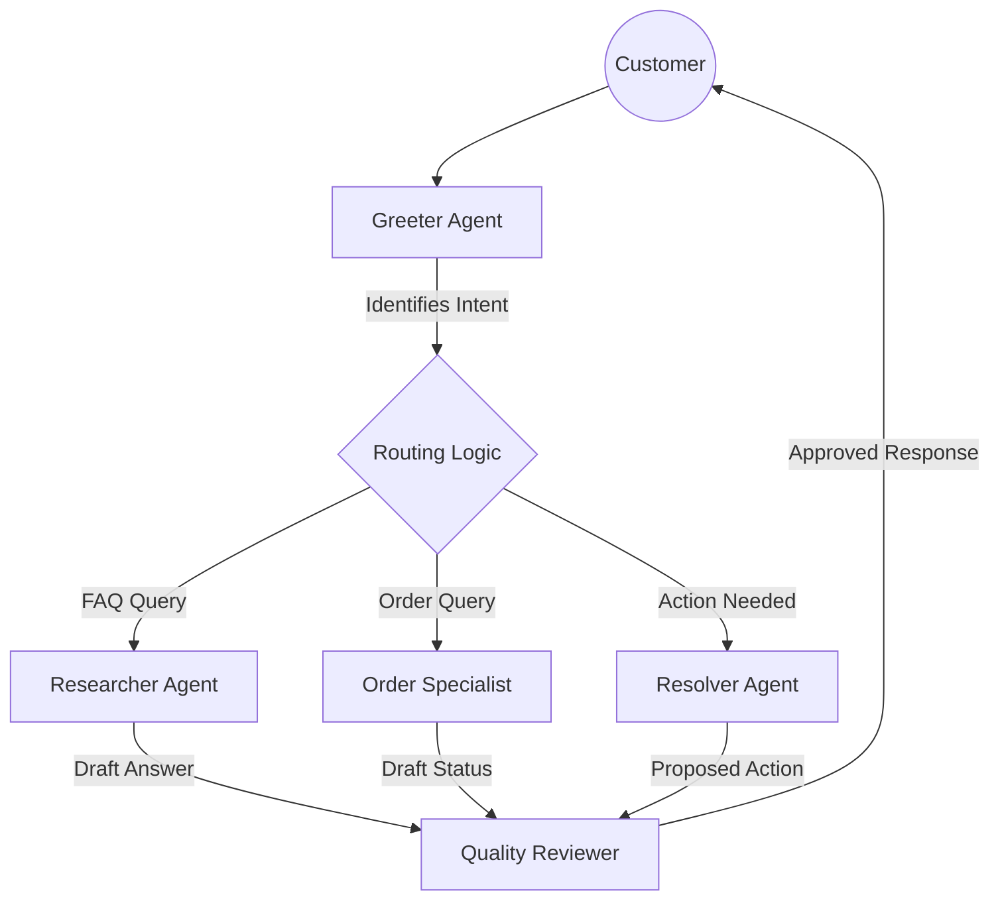

# Lab 2 - Multi-Agent Customer Support System

**Authors:** Gift Wanjiru, Nixon Masanya, Sharon Mwangi, Melissa Wachira

---

## 📋 Chosen Use Case & Rationale

**Scenario:** Customer Care Agent Team

We chose a customer support scenario because it is a real problem companies face - handling tons of similar queries efficiently while still providing accurate answers. Instead of one AI trying to do everything (and potentially hallucinating), we split the work between specialized agents. This mimics a real human support team where different departments handle different issues.

---

## 👥 Agent Team Diagram

### Roles & Communication Flow



### Agent Roles

1.  **Greeter**: "What does the customer need?"
    *   **Job**: Classify intent (FAQ, Order, or Complex)
    *   **Tools**: None

2.  **Researcher**: "Find the answer in our docs"
    *   **Job**: Look up policies, procedures in the FAQ database
    *   **Tools**: `search_faq`

3.  **Order Specialist**: "Get order details"
    *   **Job**: Track shipments, check status in order database
    *   **Tools**: `lookup_order`

4.  **Resolver**: "What action should we take?"
    *   **Job**: Plan refunds, escalations, or tickets
    *   **Tools**: `log_action`

5.  **Quality Reviewer**: "Is this answer good enough?"
    *   **Job**: Critique response, ensure accuracy & tone
    *   **Tools**: None (Reflection agent)

6.  **Supervisor**: "Who needs to work on this?"
    *   **Job**: Coordinate team (Optimized via routing logic for speed)

---

## 🚀 How to Run

### Prerequisites
*   Python 3.12+
*   Node.js 18+ (for frontend)
*   **Groq API Key** (Free at [console.groq.com](https://console.groq.com))

### Backend Setup
```bash
cd backend
python3.12 -m venv venv
source venv/bin/activate
pip install -r requirements.txt

# Copy example env and add your key
cp .env.example .env
# Edit .env and paste your GROQ_API_KEY
```

### Start System
1.  **Start Backend:**
    ```bash
    python app_multiagent.py
    ```
    Runs on `http://localhost:5000`

2.  **Start Frontend:**
    ```bash
    cd frontend
    npm install
    npm run dev
    ```
    Runs on `http://localhost:5173`

---

## 💬 Example Interaction Transcripts

### Example 1: FAQ Query (Fast Path)
**User:** "What is your shipping policy?"

> **Greeter:** Identifies as FAQ question.
> **Researcher:** Searches FAQ database.
> **Researcher finds:** "Standard shipping takes 3-5 business days. Express shipping takes 1-2 business days."
> **Quality Reviewer:** Formats response.
>
> **Final Response:** "We ship standard orders within 3-5 business days, and express orders within 1-2 business days."
> *(Response time: ~1.5 seconds)*

### Example 2: Order Lookup
**User:** "Check order 12345"

> **Greeter:** Identifies order query.
> **Order Specialist:** Looks up `12345` in database.
> **Order Specialist finds:** Status=`Shipped`, Tracking=`TRK123456789`, ETA=`Jan 31`.
> **Quality Reviewer:** Polishes answer.
>
> **Final Response:** "Your order 12345 has been shipped! Tracking number is TRK123456789. Expected delivery: Jan 31, 2026."

### Example 3: Complex Multi-Intent
**User:** "Hi, what's your return policy and can you check order 67890?"

> **Greeter:** Identifies multiple intents.
> **Researcher:** Finds return policy: "30 days, unused items, original packaging".
> **Order Specialist:** Finds order `67890`: Status=`Processing`.
> **Quality Reviewer:** Combines both pieces of info.
>
> **Final Response:** "Hello! Our return policy allows returns within 30 days if items are unused and in original packaging. Your order 67890 is currently being processed and should ship soon."

---

## ⚠️ Key Challenges & Solutions

### 1. Speed & Latency
*   **Problem:** Early local LLM tests (Ollama) took 2+ minutes per response.
*   **Solution:** Switched to **Groq API**, reducing inference time to <2 seconds. Also implemented an "optimized routing" path (2 agents) for simple queries to avoid running the full 6-agent crew unnecessarily.

### 2. Hallucinations / Verbosity
*   **Problem:** The Quality Reviewer sometimes added polite filler or made up details not in the FAQ.
*   **Solution:** Refined system prompts to strictly forbid adding external information. "Use ONLY the provided context" was added to the agent instructions.

### 3. Loop Coordination
*   **Problem:** Multi-part queries (FAQ + Order) were difficult to coordinate sequentially.
*   **Solution:** Implemented a shared conversation history and ensured the Quality Reviewer has visibility into outputs from ALL previous agents, allowing it to synthesize a single coherent answer.

### 4. API Cost Management
*   **Problem:** Running 6 agents for every "Hello" wasted tokens.
*   **Solution:** Optimised router handles simple greetings/FAQs with fewer steps, reserving the full squad for complex tickets.
